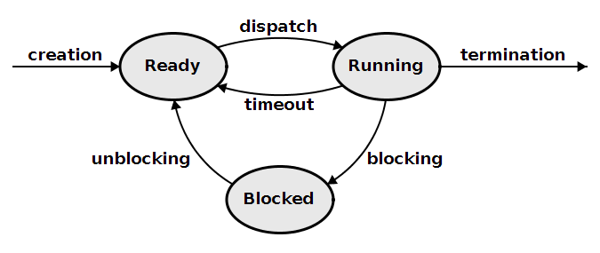

# Process Concept

## The Process

**Process** = **Program on execution**

**Program** : **Passive entity**, with command lists on file  
**Process** : **Active entity**, with Program counter and corresponding resources

## Process State

There are 5 steps for Process

1. **NEW** : process is on creation
2. **RUNNING** : process is executing commands
3. **WAITING** : process is waiting for some signal or IO to be completed
4. **READY** : process is waiting to be assigned to processor
5. **TERMINATED** : process is terminating

To be more specific, considering swap space there would be 2 more states:

    6. **SWAPPED OUT AND WAITING** : process has been swapped out on waiting  
    7. **SWAPPED OUT AND BLOCKED** : process has been swapped out on blocked

## Process Control Block

PCB is data structure in the operating system kernel containing the information needed to manage a particular process.  
The fields varies to OS, but there are some common fields like:

**Process Status** : new, ready, running, waiting, etc.  
**Program Counter \(PC\)** : PC points next command of the process to be executed.  
**CPU Registers** : accumulator, index register, stack register, general purpose register, etc. These states are saved with PC on interrupt, and then restored on execution.  
**CPU Scheduling Infos** : process priority, pointer to schedule queue and other scheduling variables.  
**Memory Management Infos** : base register, limit register, page table, segment table, etc.  
**Accounting Infos** : CPU use time, actual use time, time limit, account number, job or process number, etc.  
**IO status Infos** : IO Devices on this process, opened file list, etc.

## References

[https://commons.wikimedia.org/wiki/File:Process-in-memory.jpg](https://commons.wikimedia.org/wiki/File:Process-in-memory.jpg)

[http://www.d.umn.edu/~gshute/os/processes-and-threads.xhtml](http://www.d.umn.edu/~gshute/os/processes-and-threads.xhtml)

[https://stackoverflow.com/questions/28795024/who-controls-the-process-control-blockpcb/28795091](https://stackoverflow.com/questions/28795024/who-controls-the-process-control-blockpcb/28795091) 

[https://en.wikipedia.org/wiki/Process\_state](https://en.wikipedia.org/wiki/Process_state)

